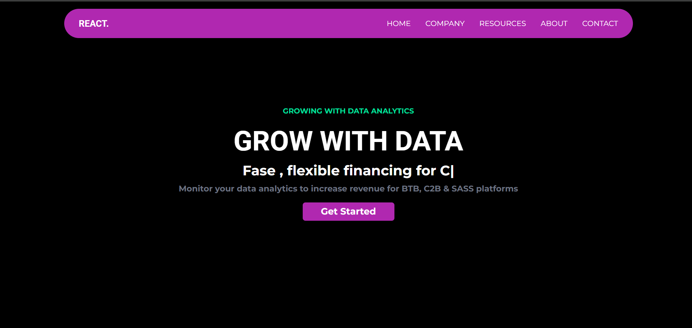
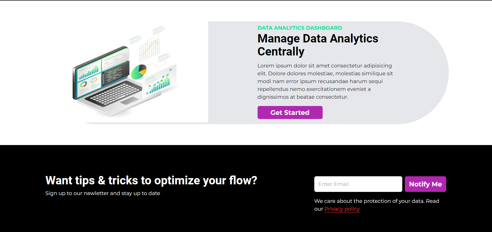
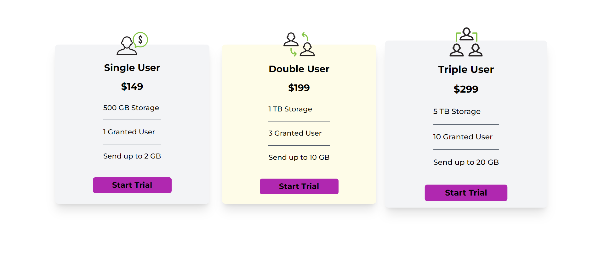
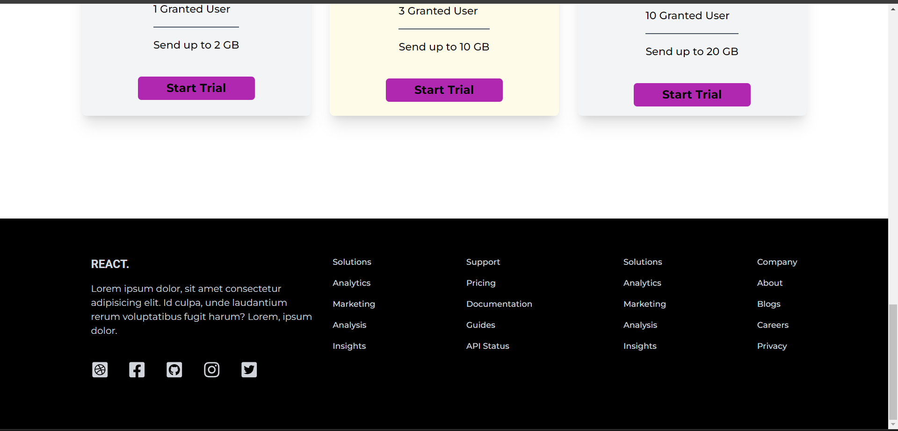

# Finance Data Website

This project is a React-based website that displays finance webapp.

## Live Demo

Check out the live demo <a href="https://lourduradjou.github.io/finance-data-website-frontend-react/" target="_blank">here</a>.

## Screenshots






## Technologies Used

- React
- Tailwind CSS

## Getting Started

To get a local copy up and running follow these simple steps.

### Installation

1. Clone the repo
   ```sh
   git clone https://github.com/lourduradjou/finance-data-website-frontend-react.git
   
2. Install dependencies
   ```sh
   npm install
   
3. Run the project
   ```sh
   npm start
